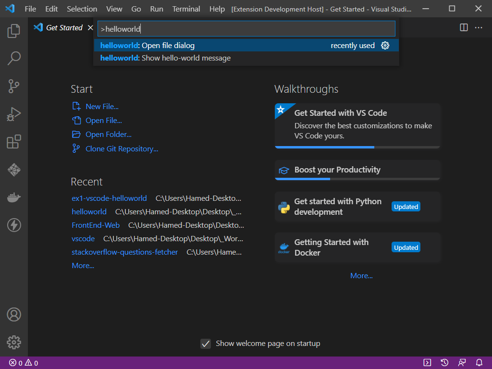

# EX1: VS-Code `helloworld` extension

The first step to learn about VS-code extensions:
[https://code.visualstudio.com/api/get-started/your-first-extension](https://code.visualstudio.com/api/get-started/your-first-extension)

# Run

Inside the editor select `src/extension.ts` file, then press `F5`. This will compile and run the extension in a new Extension Development Host window.

Run the Hello World command from the Command Palette (Ctrl+Shift+P). Then search for `helloworld: Show hello-world message` or `helloworld: Open file dialog and run` and click on it to call a command.

## VS Code API

### `vscode` module

- [`commands.registerCommand`](https://code.visualstudio.com/api/references/vscode-api#commands.registerCommand)
- [`window.showInformationMessage`](https://code.visualstudio.com/api/references/vscode-api#window.showInformationMessage)

### Contribution Points

- [`contributes.commands`](https://code.visualstudio.com/api/references/contribution-points#contributes.commands)

## Running the Sample

- Run `npm install` in terminal to install dependencies
- Run the `Run Extension` target in the Debug View.
